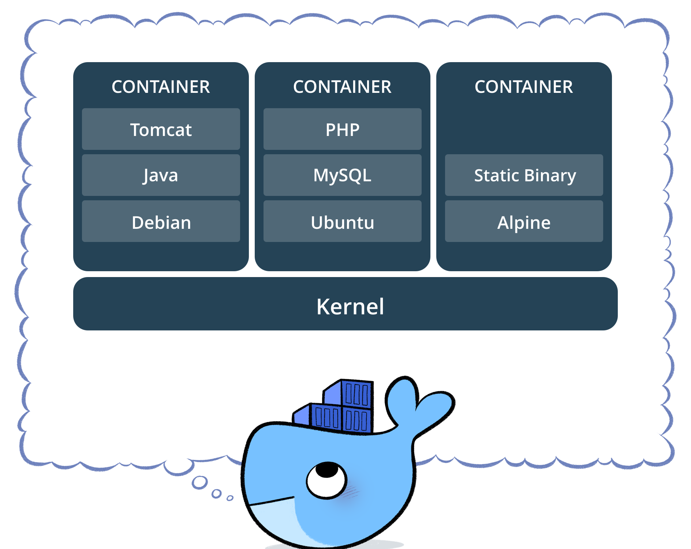

============
 Containers
============

Kubernetes is a *container orchestration platform* so containers are
at the heart of the technology.

Overview
========

Containers are *isolated* groups of processes running on a single
host. They run directly on a host without any intermediate layer as
opposed to `Virtual Machines`_ which require a `Hypervisor`_ to be
present. This is also the reason why containers are referred to as
a "light-weight" solution to deploy applications. And finally, all
containers share the kernel.

The most important point to note is the fact that container processes
run directly on the host. As can be seen in the following picture,
there is no intermediate layer as is the case with virtualization such
as `vmware`_ and `VirtualBox`_.

So if the container processes run directly on the host, what stops
them from seeing each other or even affecting each other? That is
where the isolation aspects of the kernel comes in. Kernel has
provisions to isolate or sandbox a process (or a group of processes)
to the point that the processes believe that they are running on a
dedicated host. This is  despite the fact that they are just normal
processes on the host and they can be seen from the host just like any
other processes (given sufficient permissions).

A container is usually a single process though sometimes you see
more than one process as well. Containerization involves creating an
isolated environment around a process or group of processes. Basically
we limit the processes in terms of what they can see and what they can
do.

Finally, it is important to understand that all containers share same
running kernel. There is no isolation there and that is the biggest
difference between `Virtual Machines`_ and containers. A side
effect of sharing the kernel is that if the container uses a
kernel module or does something with a kernel module, there is no way
to isolate it from other containers.

.. note 

  There are some container solutions such as Kata containers that
  offer more isolation.

Container building blocks
=========================

- chroot

    - A system call that changes the root directory of a process. 

- namespaces

    - Allow partitioning of virtual system resources such as PIDs and
      mounted file systems. 

- control groups (cgroups)

    - Allow partitioning of physical system resources such as CPU and
      memory).

These are three fundamental features of Linux kernel that make
containers work. 

chroot system call allows a process's root directory to be
changed to any directory. Once that is done, the process can only see
and use files that are reachable from the new root directory. chroot
has been a feature of Unix for a very long time and is the basis for
very early container technologies. 

Namespaces provide features similar to multi-tenancy where the kernel
provides isolation for each supported resource type. For example, PIDs
are one such resource where namespaces are supported. If two processes
are running in two different namespaces, each can have same PID.
Similar to PIDs, there are many other resource types for which
namespaces are supported. 

Here are some examples:

PID
    Isolates process ID ranges so that processes in different
    namespaces can have same PID. 

User
    Isolates UID and GID numbers. Especially useful to run as root
    inside the container. 

UTS
    Provides isolation for host name and domain name.

Control groups (cgroups) allow limiting physical resources to a group
of processes (or a single process). For example, if you want to limit
a process to 100MB of main memory even though the host has much larger
memory, you can easily do that using cgroups.

So namespaces, cgroups, and chroot work together to make containers
possible. Docker and other container solutions are nothing more than
wrapper programs that cleverly use these three features to give the
illusion of isolation.

Docker
======

Containers existed in one form or another for very long
time. E.g. Solaris Zones, lxc. But Docker brought the technology to
mainstream due to following reasons:

- Defined a simple and portable image format
- Made it easy to build new images
- Made sharing a breeze (Docker Hub)

Google has been using containers for long time, since 2005 onwards at
least. In fact, the initial code for cgroups has been donated by
Google. Since then, namespaces were added to the mix and then "lxc"
came along as a container solution.

But the real popularity in the wide developer world started after
Docker came into the picture. The main reasons are the portable image
format and APIs.

At its simplest, a docker image is nothing but a tar file. You can
build images by making modifications in the existing images. The image
format is not standardized as open container spec.

**TODO** Mention container run time and image format specs. 

**TODO** Show few examples of running containers. Use MongoDB as en
example.

.. _Hypervisor: https://en.wikipedia.org/wiki/Hypervisor
.. _Virtual Machines: https://en.wikipedia.org/wiki/Virtual_machine
.. _VirtualBox: https://www.virtualbox.org/
.. _vmware: https://www.vmware.com/solutions/virtualization.html
