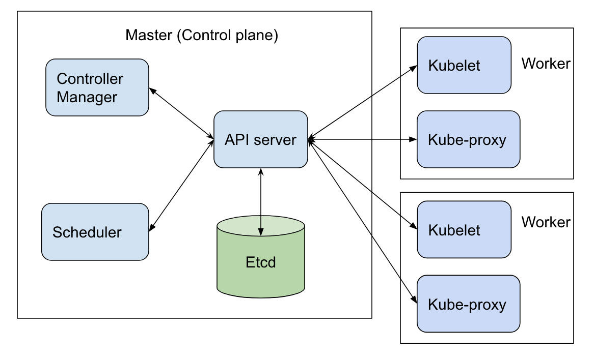

=====================
 Kubernetes Overview
=====================

In the last chapter, we built a Docker image of a simple HTTP server
and ran it as a container. We are now ready to enter the world of
Kubernetes and see how we can run the same server inside Kubernetes. 

In a Kubernetes cluster, a "Pod" is the smallest unit that can be
deployed and run. It is essentially a container or a group of
containers. We will learn more about Pods and why they support group
of containers in later sections but for now, it is sufficient to
understand that a container is wrapped in a "Pod" to be run in a
Kubernetes cluster.

Before we take a deep dive into Kubernetes concepts, let us try to
understand what exactly is a "Kubernetes cluster". The following
diagram shows Kubernetes components at a very high level.

A very concise overview of the architecture:

- Kubernetes is a cluster solution in that it manages multiple nodes
  and can seamlessly run pods on any node.

- There is a master node that runs the components that "manage" the
  cluster. These components are typically referred to as "control
  plane" of the cluster. Note that it is possible to have more than
  one master if you want to create highly available clusters but for
  our discussion, we will assume there is a single master node.

- The remaining nodes are 'worker" nodes that run pods. The
  cluster components that run on the worker nodes are referred to as
  "Node components". 

Typically, master node is dedicated to running control plane
components and workloads are not run there. But you can easily change
that and if you are using a one node cluster, you obviously need to do
that.

Here is a brief description of each component in a Kubernetes cluster.
We will learn more details about them in the coming chapters. 

API server
    API server is the front end to the cluster. It implements the
    Kubernetes REST API. An important point is that the APIs are used
    not only by external components but internal components as well
    (though they may use a slightly different format of the API). 

Etcd
    Etcd is a distributed key-value store and is used by API server to
    persist all resources. 

Scheduler
    Decides which node should run a newly created pod.

Controller Manager
    Comprises of several different "controllers" that manage
    Kubernetes resources such as nodes, pods, service accounts etc. 

Kubelet
    Runs on each node and makes sure that pods are running containers
    as per the spec.

kube-proxy
    Runs on each node. It implements the network semantics for the
    cluster by forwarding traffic from one node to the other. 

Now that we have a high level understanding of what Kubernetes is, we
need a test environment where you can run the commands and see the
cluster in action. There are many options when it comes to setting up
a test Kubernetes cluster. The  easiest perhaps is to use `Katacoda`_
but my personal preference is to install `minikube`_ locally.  

Minikube
========

Minikube creates a one node cluster that is very handy to test things
locally. It can install cluster components in several different ways. 

- Directly on the host itself
- Using Docker
- Using VirtualBox VM

The recommended way is to use "Docker", like so:

.. code-block:: bash

   $ minikube start --vm-driver docker

Kubectl
=======

To access the cluster we just created, we need `kubectl`_ which is a
command line tool to manage and control Kubernetes clusters. If you
work with Kubernetes actively, you will be spending lot of time
running this command so it is very important and useful to master it.

Using ``kubectl``, you can perform CRUD actions on all Kubernetes
resources. After installing minikube and kubectl, run the following
command to verify that the test setup is working:

.. code-block:: bash

   $ kubectl -n kube-system get pod

   NAME                           READY   STATUS    RESTARTS   AGE
   coredns-66bff467f8-mdr29       1/1     Running   0          5d19h
   coredns-66bff467f8-rrxxd       1/1     Running   0          5d19h
   etcd-test                      1/1     Running   0          5d19h
   kindnet-lnmg9                  1/1     Running   0          5d19h
   kube-apiserver-test            1/1     Running   0          5d19h
   kube-controller-manager-test   1/1     Running   0          5d19h
   kube-proxy-wp5pm               1/1     Running   0          5d19h
   kube-scheduler-test            1/1     Running   0          5d19h
   storage-provisioner            1/1     Running   0          5d19h

The command shows all the running pods in the namespace "kube-system"
(more about namespaces later). You can see some of the components we
discussed earlier such as *etcd* and *apiserver* in the listing above.

Running the HTTP Server
=======================

We are now ready to run our basic HTTP server in a Kubernetes
cluster. 

First, we need to add the Docker image of our basic server (which we
built in the last chapter) to minikube cluster we just created::

    $ minikube cache add basicserver:0.42

This step is only necessary for local images. If the image is
available in `Docker Hub`_ or in some other Docker registry, we don't
need to explicitly add the image to the cache.

Let us now run the server::

    $ kubectl run --image basicserver:0.42 testpod
    pod/testpod created

    $ kubectl get pod
    NAME      READY   STATUS    RESTARTS   AGE
    testpod   1/1     Running   0          4s
    
We can see that the HTTP server pod is running. However, even though
the server is running, it is not reachable from outside the cluster
yet. One way to fix this is to expose the pod as a "service"::

    $ kubectl expose pod testpod --name testsvc --port 5000 --type NodePort
    service/testsvc exposed

This command creates a "service" of type "NodePort" that maps pod's
port (5000) to a port on the node. This will allow us to reach the
HTTP server using the node address. The following command shows the
newly created service, including the port at which the HTTP
server can be reached::

    $ kubectl get svc/testsvc
    NAME      TYPE       CLUSTER-IP      EXTERNAL-IP   PORT(S)          AGE
    testsvc   NodePort   10.100.29.140   <none>        5000:32490/TCP   20s

From the command response, we can see that port 32490 is where the
service can be reached. We can easily verify that using the curl
command similar to what we used in the previous chapter.

.. code-block:: bash

  $ curl http://localhost:32490
  Hello, World!

That's it! We now managed to run our server in three different
environments - on the host directly, as a Docker container, and
finally in a Kubernetes cluster. But do note that the above commands
were only meant to get a pod and service up and running for some quick
testing. They are not the recommended way to create resources in a
Kubernetes cluster.  

In the next chapter, we will learn all about pods and some other
abstractions that work with pods. In the process, we will also learn
some general concepts about Kubernetes resources and the recommended
way of creating and otherwise managing such resources.

**More content is coming soon. Stay tuned!**

.. _Katacoda: https://www.katacoda.com/courses/kubernetes/playground
.. _minikube: https://minikube.sigs.k8s.io/docs/
.. _kubectl: https://kubernetes.io/docs/tasks/tools/install-kubectl/
.. _Docker Hub: https://hub.docker.com/
